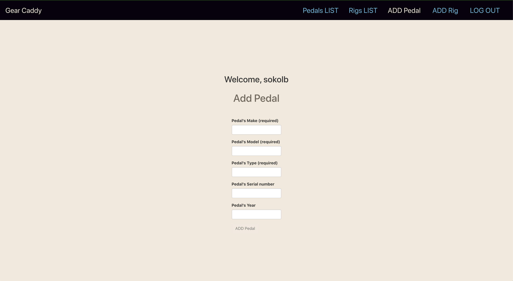
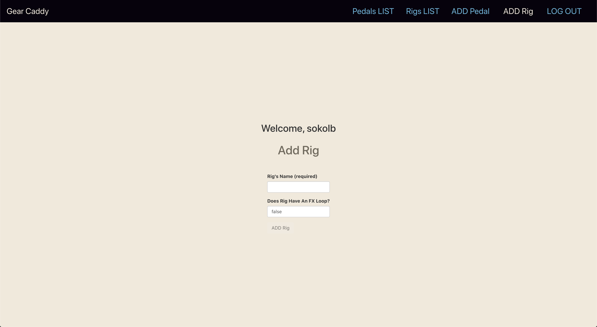
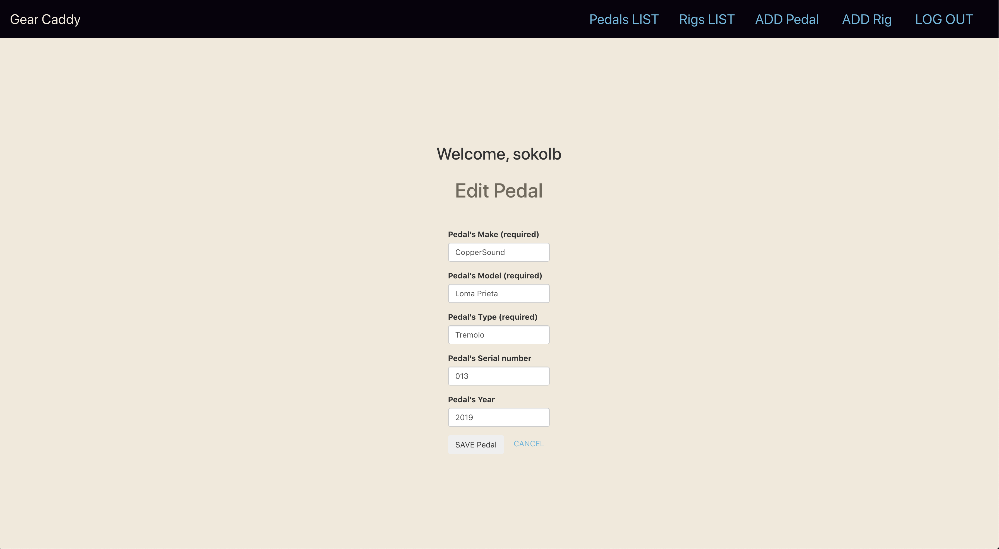
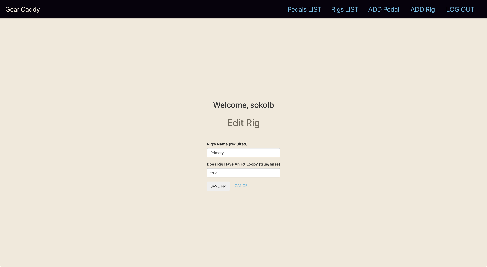
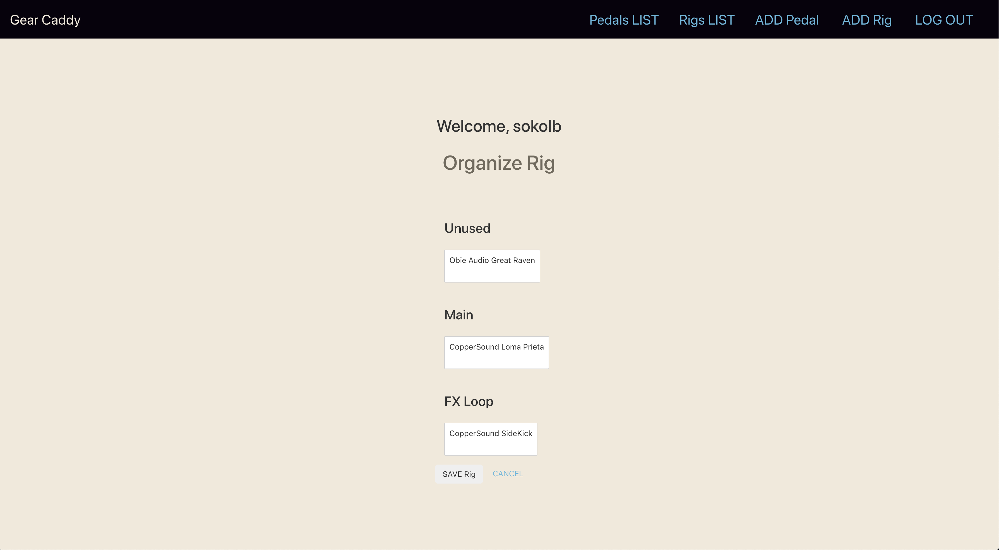
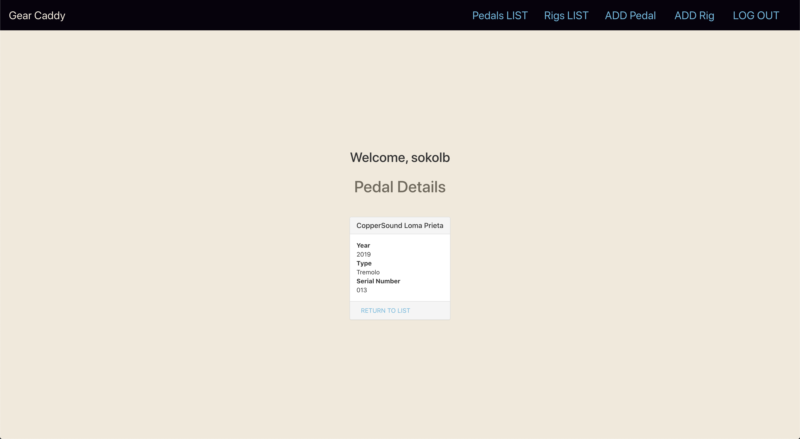
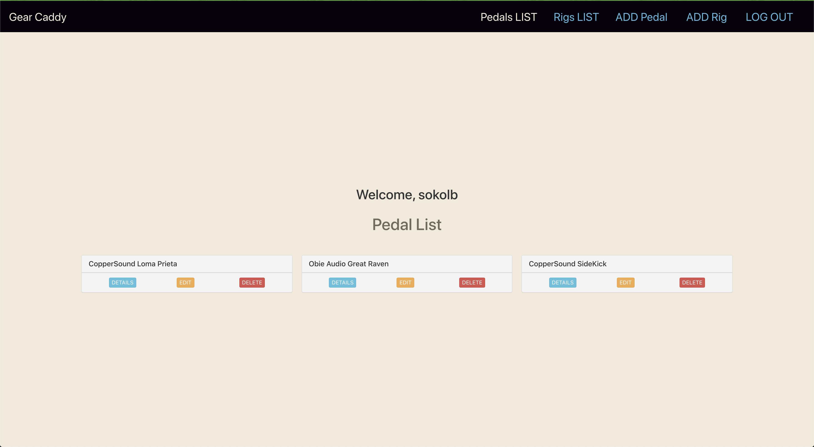
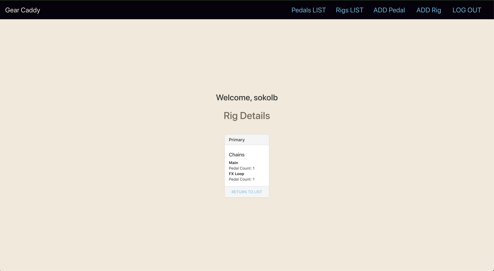
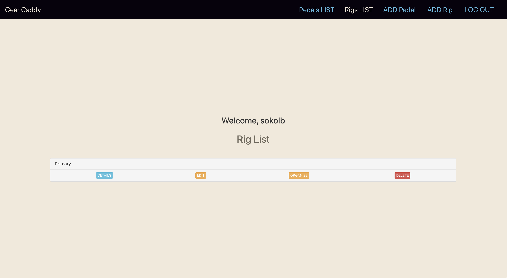

# Gear Caddy

### This is an app for managing and organizing your guitar effects pedals. Add all of your pedals, create new rigs, and organize your pedals within your rigs.

## Screen Shots

## Technologies Used

- MongoDB
- ExpressJS
- NodeJS
- ReactJS
- Mongoose

## Getting Started

[Link to app](https://gear-caddy.herokuapp.com/)

[Link to Trello](https://trello.com/b/XROSz1fE/gear-caddy-trello)

## Next Steps

### I plan on implementing several icebox items, including, but not limited to:

- Styling
- Add Amplifier model 
- Add Instrument model
- Add User Favorites
- Add photos to all models (profile Avatar, gear photos and presets)
- Add profile page
- Add most used gear page
- Change redirect for add rig page to organize rig page